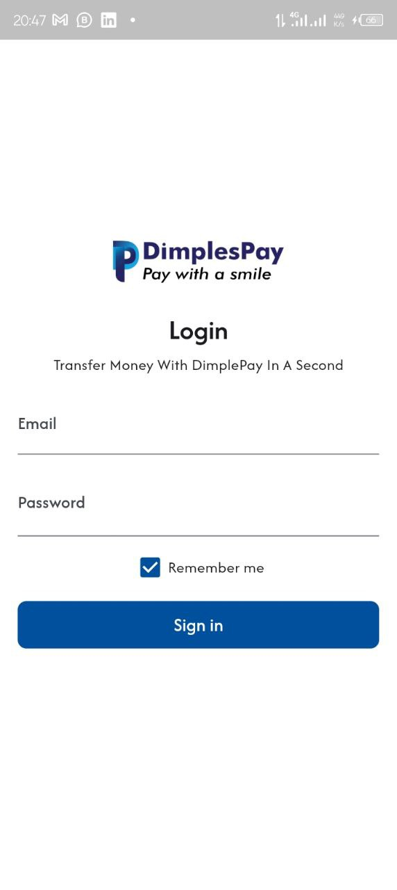
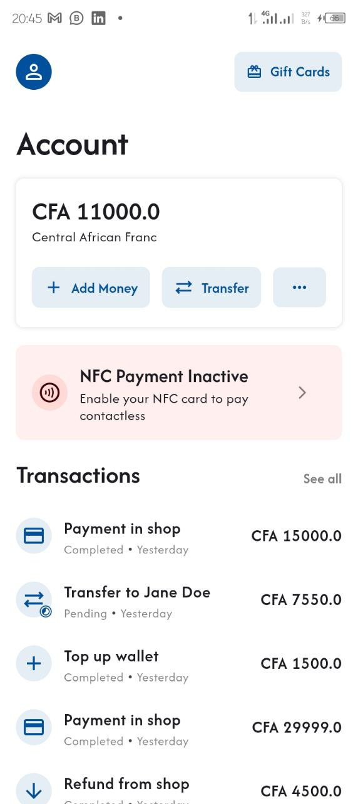
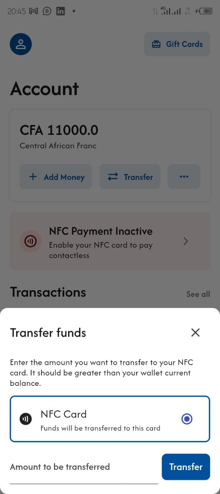
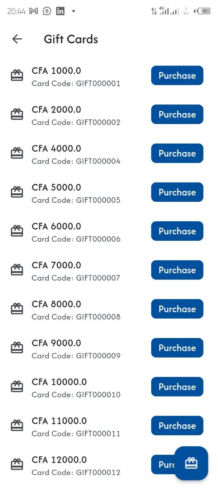

# DimplesPay feature implementation

A new Flutter project.
_Version: 3.24.3_

## About

**State Management**
We've used [GetX](https://pub.dev/packages/get) for efficient state management.

**API Integration**
The app communicates with the [backend API](https://github.com/Asmitta-01/DimplesPay-api/) to fetch and send data. Ensure you have the correct API endpoints and authentication mechanisms in place.

**Note**: The api [baseUrl](https://github.com/Asmitta-01/Dimplespay-feature---Internship-Test/blob/bde7deecef0b35429c6fe162b1955d9ebc0e334e/lib/utils/api_service.dart#L10) value depends on your platform.

E.g.

- On real device it should be the ip address of your PC, assuming your device and Phone are on a same network.
- On an emulator you should put `10.0.2.2`

### Screenshots

|||
|----------------------------------|-----------------|
|||

## Tasks

- Develop a small mobile application to demonstrate proficiency in:
- Consuming REST APIs for user authentication and wallet management.
- Implementing NFC card functionality.
- Adding a gift card purchasing and redeeming feature.

### Project Requirements

1. User Authentication
Implement a login system that allows users to log in using email and password.
Consume an API endpoint for user authentication. (Provide a mock API endpoint or instructions to set up a simple local API.)
Display a dashboard after login, showing the user’s wallet balance and recent transactions.
2. Wallet Management
Fetch the user's wallet balance from an API and display it on the dashboard.
Provide functionality to top-up the wallet using a mock API endpoint.
3. NFC Card Features
Simulate NFC card functionality:
Activate a card: Provide an option to activate an NFC card using an API endpoint.
Top-up card balance: Allow the user to transfer funds from their wallet to the NFC card.
Deduct card balance: Implement a two-step process where the user enters an amount to deduct, confirms it, and enters a PIN to complete the transaction.
Add a feature to fetch and display NFC card details (e.g., card ID, balance).
4. Gift Card Features
Fetch a list of available gift cards from an API endpoint.
Allow the user to purchase a gift card using their wallet balance.
Provide a mock redemption feature where the user enters a code to redeem a gift card.
5. UI/UX
Use a clean and responsive design.
Display appropriate success and error messages for all actions.
6. API Handling
Demonstrate good API consumption practices (e.g., error handling, token-based authentication, proper HTTP methods).

### Deliverables

A working mobile app showcasing the requested features.
A brief documentation file explaining:
How to set up and run the app.
Any design or architectural choices made during development.
Areas for potential improvement or optimization.

### Evaluation Criteria

1. Code Quality: Clean, modular, and well-documented code.
2. API Integration: Ability to consume APIs effectively with proper error handling.
3. UI/UX Design: Simple and intuitive user interface.
4. Feature Completion: Implementation of all required features.
5. Problem-Solving: Handling edge cases and demonstrating a logical approach to challenges.
6. Mock API Endpoints (Provide or simulate locally)
You can provide mock endpoints using tools like Postman, JSON Server, or a simple Express.js/Flask API. Here are example endpoints:

Implement the endpoints ont the postman link below : <https://apropla.postman.co/workspace/Aproplat~3a9bd73b-6ef1-45c8-80de-7ef7fd89bcfb/folder/15878137-a8dec2d9-1193-458f-82bf-20e4e2df9338?action=share&source=copy-link&creator=15878137&ctx=documentation>

### Technical Expectations

- Preferred Frameworks: Flutter
- State Management: Use any preferred state management solution.
- Version Control: Use Git for version tracking and share the repository link.
- Testing: Basic unit tests for at least one feature.
